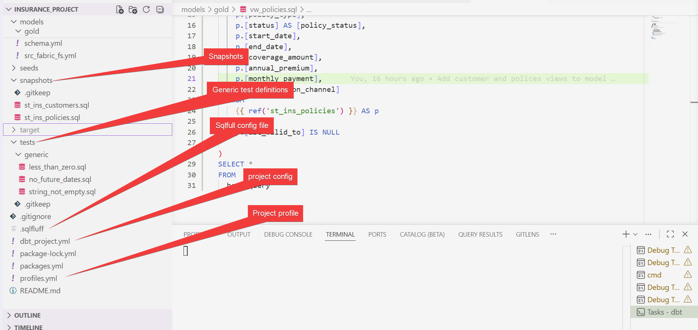
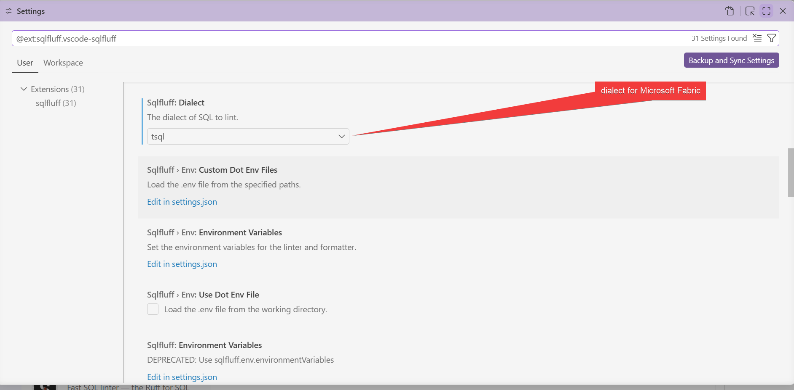
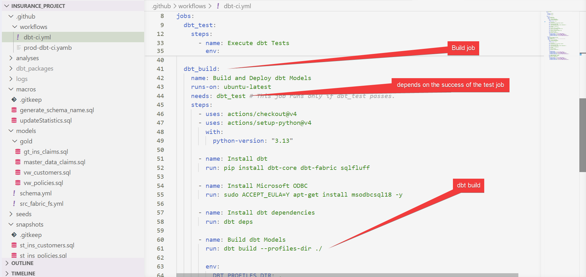
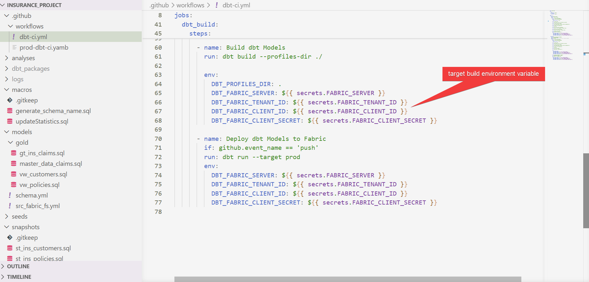
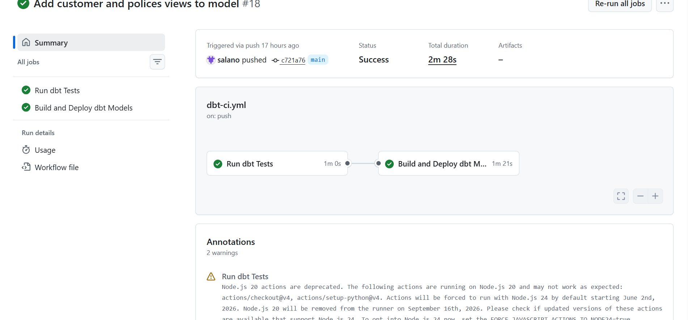
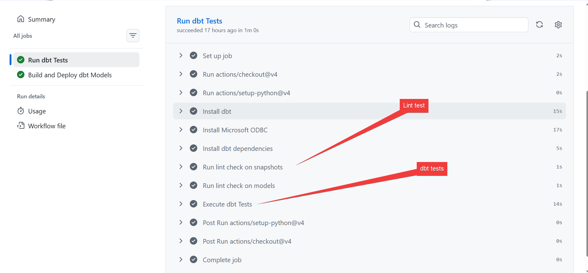

This project was created as supplementary project for the Microsoft Fabric Insurance Project which can be found [here](https://github.com/salano/MS-Fabric-End-to-End-Insurance-Project)

We created a DBT project to validate and transform the data for the silver and gold layers in medallion architecture of the Microsoft Fabric project.

We will use Microsoft Azure Service Principal to connect to our Warehouse in Microsoft Fabric.

We assume you have a Microsoft Azure Service Principal Account added as a Member/Contributor role in the Microsoft Fabric workspace.

In the DBT project we do the following:

- Update the statistics on gold layer tables after DBT builds
- Create SCD type 2 modelling for the customers and policies snapshots
- Create a Incremental claims and master data models
- Create views for the polices and customers data in the gold layer
- Validation:
  - Apply unique constrainst to key columns
  - Apply not null constrainst to key columns
  - Apply accepted values constrainst selected fields - status, gender etc
  - Apply relationship constraints between the tables
  - Test money value fields have values greater than 0
  - Test string values are not empty
  - Test date fields have no future date values
- Linting test

The DBT projec:

We want to create a basic CI pipeline in GitHub to run tests and build the project. This will ensure we are using tested DBT project in Microsoft Fabric.
We will perform the followin in the pipeline

1. SQL linting (we use [sqlfluff](https://www.sqlfluff.com/))
2. dbt testing
3. dbt build/run

> Sqlfluff installation

> Sqlfuff configuration

The CI Pipeline

We set the repository secret variables to execute the GitHub runner.

On push to main branch. We can see the logs

